# 📚 Projeto Aluno Online

## 📌 Descrição do Projeto

O projeto **Aluno Online** consiste em uma aplicação desenvolvida com o objetivo de gerenciar informações acadêmicas, permitindo o cadastro, consulta, atualização e remoção de dados de **alunos** e **professores**.

A aplicação segue o padrão CRUD (Create, Read, Update, Delete), sendo possível realizar operações completas tanto para alunos quanto para professores.

---

## 🚀 Funcionalidades

### 👨‍🎓 Aluno
- Criar um novo aluno
- Listar todos os alunos
- Buscar aluno por ID
- Atualizar dados do aluno
- Deletar aluno

### 👨‍🏫 Professor
- Criar um novo professor
- Listar todos os professores
- Buscar professor por ID
- Atualizar dados do professor
- Deletar professor

---

## 🛠️ Tecnologias Utilizadas

- Linguagem: Java
- Framework: Spring Boot, Lombok
- Banco de Dados:  PostgreSQL
- Ferramentas:
  - Insomnia
  - DBeaver

---

## 🏗️ Arquitetura do Projeto

O projeto segue uma arquitetura em camadas:

### 📂 Camadas:

- **Controller**
  - Responsável por receber as requisições HTTP e retornar as respostas

- **Service**
  - Contém a lógica de negócio da aplicação

- **Repository**
  - Responsável pela comunicação com o banco de dados

- **Model**
  - Representa as entidades do sistema (Aluno e Professor)

---

## 🧩 Estrutura do Projeto

Exemplo:
src/
- ├── controller/
- ├── service/
- ├── repository/
- ├── model/
- └── config/

## 🔗 Endpoints da API

### Aluno

| Método | Endpoint        | Descrição              |
|--------|----------------|----------------------|
| GET    | /alunos        | Lista todos alunos   |
| GET    | /alunos/{id}   | Busca por ID         |
| POST   | /alunos        | Cria novo aluno      |
| PUT    | /alunos/{id}   | Atualiza aluno       |
| DELETE | /alunos/{id}   | Remove aluno         |

### Professor

| Método | Endpoint             | Descrição              |
|--------|---------------------|------------------------|
| GET    | /professores        | Lista todos            |
| GET    | /professores/{id}   | Busca por ID           |
| POST   | /professores        | Cria novo              |
| PUT    | /professores/{id}   | Atualiza               |
| DELETE | /professores/{id}   | Remove                 |

---

## 🧪 Testes com Insomnia

Abaixo estão exemplos de requisições realizadas utilizando o Insomnia:

### 📌 Criar Aluno
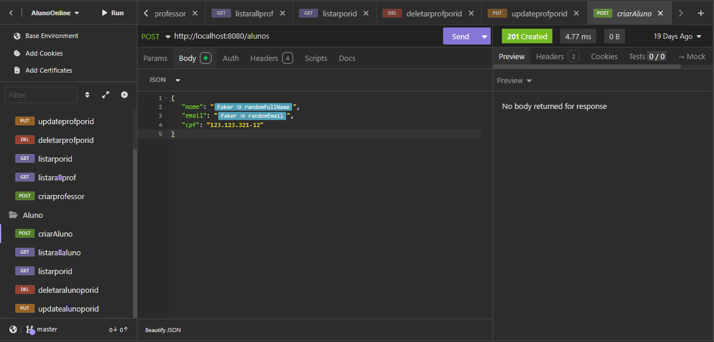

### 📌 Listar Alunos
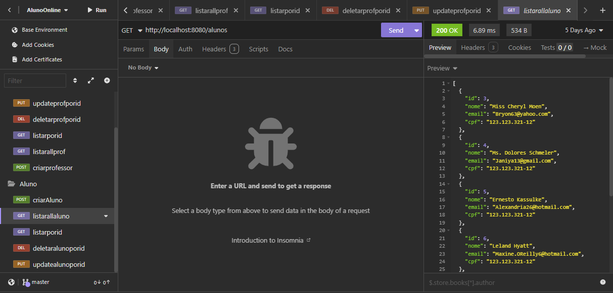

### 📌 Listar por id Aluno
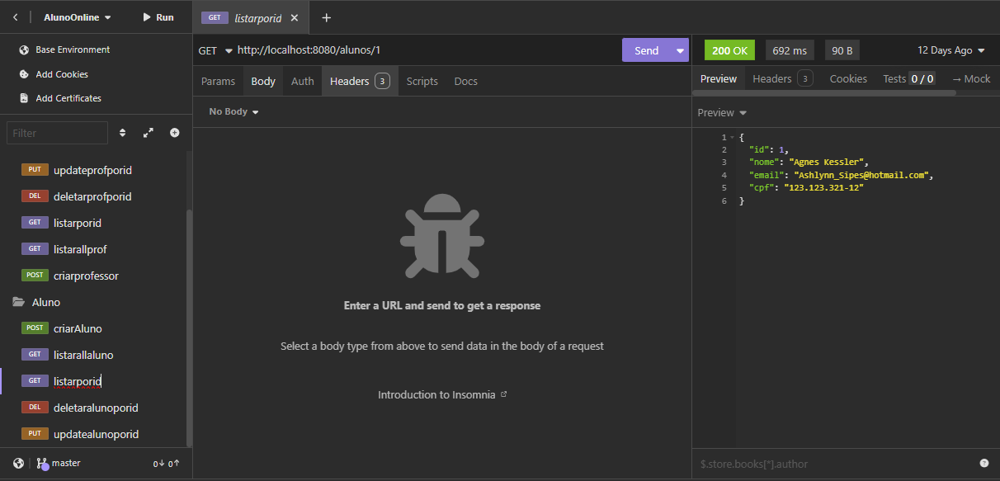

### 📌 Deletar Aluno
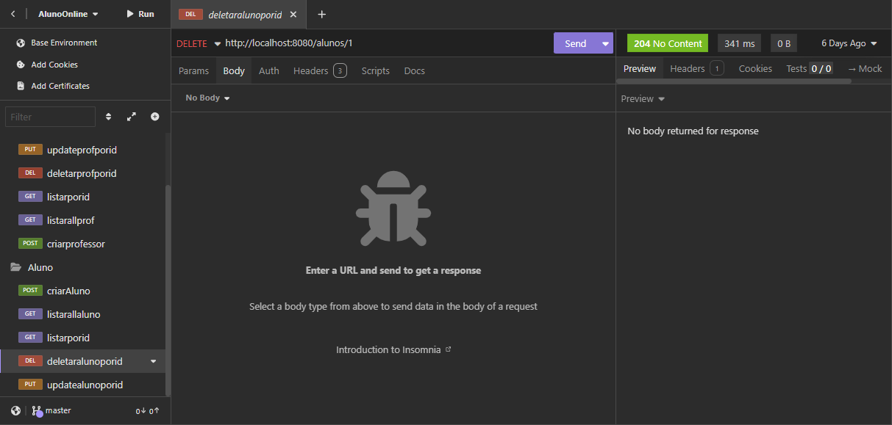

### 📌 Update Aluno
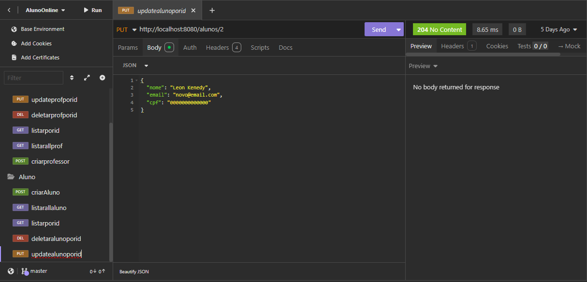

### 📌 Criar Professor
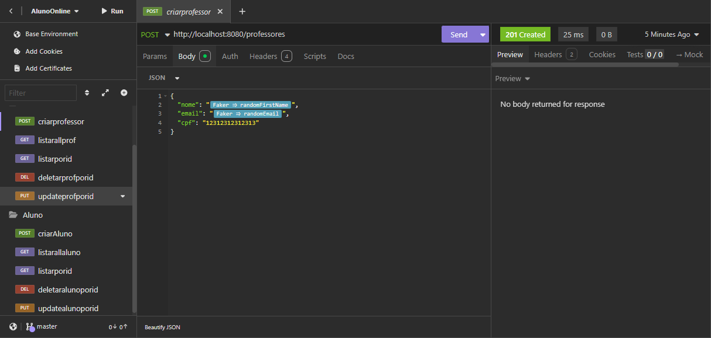

### 📌 Listar Professores
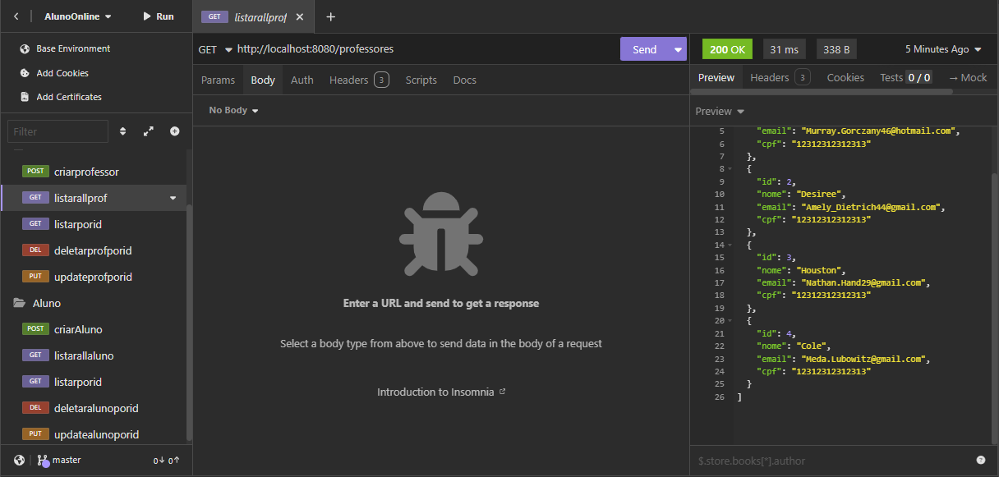

### 📌 Listar por id Professor
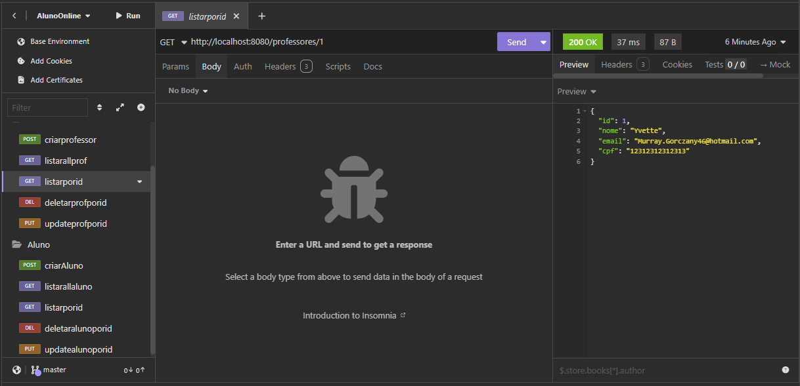

### 📌 Deletar Professor
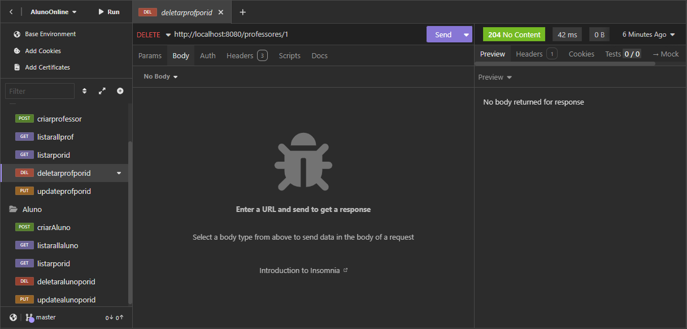

### 📌 Update Professor
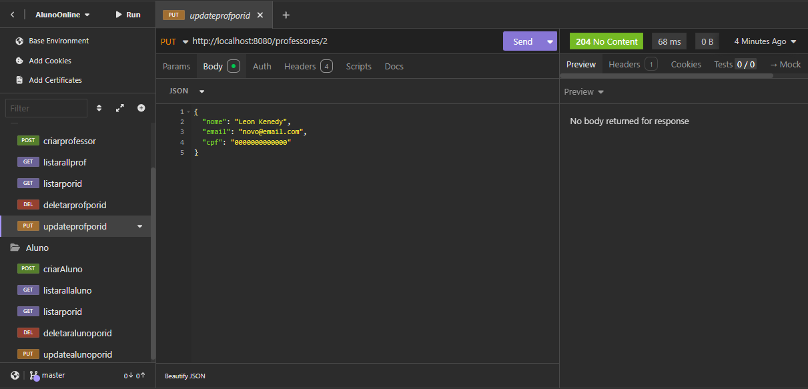

---

## 🗃️ Visualização do Banco (DBeaver)

### 📌 Tabela Aluno
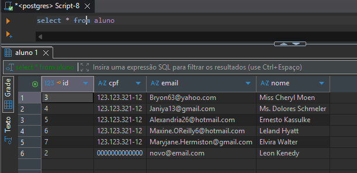

### 📌 Tabela Professor
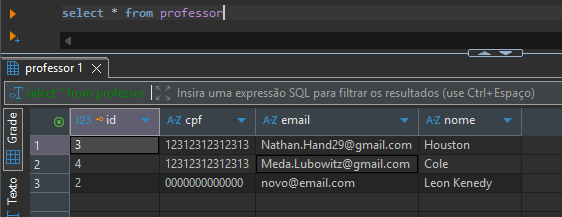

---
